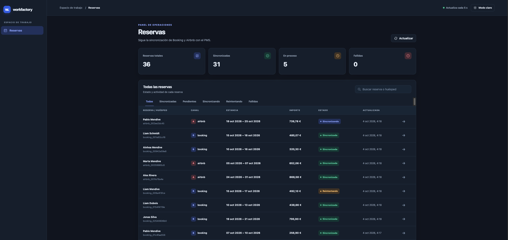

# Sincronizador de reservas

Servicio Java 21 que consulta los eventos de Booking y Airbnb, normaliza sus reservas y las envía a un PMS lento. La API y la pantalla permiten seguir el estado de cada reserva y reintentar manualmente las que hayan fallado.



*Captura tomada con el simulador local: muestra reservas sincronizadas, en curso y en reintento.*

## Cómo se arranca

Se necesitan Java 21 o superior, Node 22.6 o superior para el simulador y el comprobador, y Docker solo si se usa la imagen. El servicio escucha en `http://localhost:3000/` y el simulador en `http://localhost:4000/`.

### Ejecución local

En una terminal, desde `java/`:

```sh
cd mock
node --experimental-strip-types src/application/local-main.ts
```

En otra terminal, también desde `java/`:

```sh
cd backend
API_BASE=http://localhost:4000 API_TOKEN=wf_local ./mvnw compile exec:java@start
```

Abre `http://localhost:3000/`. Las variables del comando apuntan expresamente al simulador, aunque `backend/.env` contenga credenciales de otra API. Para usar la API real, copia `backend/.env.example` a `backend/.env`, configura `API_BASE` y `API_TOKEN` con los valores recibidos y ejecuta `./mvnw compile exec:java@start` sin esas variables de entorno. No incluyas el token real en el repositorio.

### Comprobaciones

Desde `java/backend/`, `./mvnw test` ejecuta las pruebas propias. Desde `java/`, `node check/check.mjs` arranca sus propios procesos y ejecuta el comprobador proporcionado. En la última ejecución local pasaron las 9 pruebas propias y las 12 comprobaciones del comprobador. La aplicación también respondió `200` en `/`, `/health` y `/api/bookings` al arrancar la imagen Docker con el simulador.

### Imagen Docker

Desde `java/`, construye la imagen:

```sh
docker build -t booking-sync:local .
```

Para probarla con el simulador local, arranca primero el simulador en otra terminal, también desde `java/`:

```sh
cd mock
node --experimental-strip-types src/application/local-main.ts
```

Después arranca el servicio desde `java/` en una terminal de macOS o Linux:

```sh
docker run --rm --name booking-sync -p 3000:3000 \
  -e API_BASE=http://host.docker.internal:4000 \
  -e API_TOKEN=wf_local \
  booking-sync:local
```

Abre `http://localhost:3000/` para ver la pantalla y `http://localhost:3000/health` para comprobar que responde. `-p 3000:3000` publica el puerto de la aplicación; `API_BASE` apunta al simulador que corre en el equipo anfitrión. Dentro del contenedor, `localhost` sería el propio contenedor. Para usar la API real, sustituye `API_BASE` y `API_TOKEN` por los valores recibidos. En Linux, añade `--add-host=host.docker.internal:host-gateway` al comando `docker run` si el simulador corre en el anfitrión.

Si construyes desde un disco externo en macOS y Docker falla con `failed to xattr ._*`, ejecuta `dot_clean -m .` desde `java/` para retirar esos archivos auxiliares de macOS y repite `docker build`.

## Por qué elegí esta tecnología

Conservé Java 21 y Maven porque el esqueleto ya incluía los clientes HTTP, Jackson y el comprobador preparado para ese arranque. `HttpServer` de la biblioteca estándar basta para estas rutas y evita añadir un framework solo para servir la API y el HTML. La estructura separa el dominio de las llamadas HTTP y permite probar el registro en el PMS con un cliente sustituible.

El código propio está repartido entre `backend/src/main/java/es/workfactory/bookingsync/` (`channel/` para los eventos, `domain/` para reservas y normalización, `pms/` para envío y reintentos, `store/` para el estado, `http/` para respuestas y `Server` para las rutas). `frontend/index.html` contiene la pantalla. `mock/` y `check/` son los recursos proporcionados, y `docs/` contiene la captura.

## Cómo usaste la IA

Usé la IA para:

- Diseñar e implementar `frontend/index.html`, porque es una parte del desarrollo que no disfruto hacer.
- Supervisar y corregir el `Dockerfile`, ya que he escrito pocos Dockerfiles y quería revisar su configuración.
- Redactar los README con una estructura profesional y ordenada.
- Investigar errores y oportunidades de optimización en el código.
- Entender el problema al inicio y definir la estructura de carpetas.
- Desarrollar pruebas para comprobar el comportamiento de la aplicación.
- Pedirle que generara diagramas de clases del proyecto.

Dividí las consultas entre estructura, implementación y validación. Revisé el código y contrasté el resultado con las pruebas propias, el comprobador y la pantalla en ejecución antes de dar por buena cada parte. Mantuve los límites que no podía verificar como garantías, especialmente la recuperación tras reiniciar y los envíos al PMS con resultado incierto, en vez de presentarlos como resueltos.

## Decisiones y lo que dejaste sin resolver

Partí del esqueleto Java y refactoricé el código para separar las responsabilidades del canal, el dominio, el PMS y el almacenamiento. `ChannelClient` realiza las llamadas HTTP, `ChannelEventConsumer` consulta y confirma eventos, los normalizadores adaptan los formatos de Booking y Airbnb a `NormalizedBooking`, y `PmsRegisterer` coordina los envíos y reintentos. Esta separación reduce la lógica concentrada en `Server` y aplica el principio de responsabilidad única donde más aporta: en los límites entre integración externa, reglas de procesamiento y API.

Para la integración con el PMS definí una interfaz pequeña, `PmsClient`, y encapsulé su implementación HTTP en `WorkfactoryPmsClient`. Este adaptador deja que `PmsRegisterer` dependa del contrato y reciba el cliente por constructor. Es una aplicación concreta de inversión de dependencias e inyección de dependencias: la política de reintentos puede probarse o reutilizarse sin acoplarla a la petición HTTP. Los componentes se crean y conectan en `main`, en un único punto de composición.

Usé el patrón productor-consumidor para separar la recepción de eventos del trabajo lento del PMS y priorizar la confirmación dentro del plazo exigido. Una `DelayQueue` programa los reintentos sin bloquear la recepción de nuevas reservas. Un semáforo acota la capacidad a 1024 trabajos y un conjunto de IDs evita encolar dos veces una reserva que ya está pendiente o en curso. El trabajador tiene supervisión para volver a arrancarlo si termina inesperadamente y una parada ordenada. El reintento manual solo acepta reservas `failed` y reinicia su ciclo de intentos.

Para la normalización apliqué la idea del patrón Strategy: `BookingPayloadNormalizer` y `AirbnbPayloadNormalizer` encapsulan dos formas de convertir un payload al mismo modelo, y `ChannelPayloadNormalizer` selecciona la adecuada según el canal. Así las diferencias de nombres y fechas no se propagan al resto del servicio. La selección actual usa un `switch`, de modo que añadir otro canal también requiere ampliar ese selector. Valido los campos obligatorios y convierto las fechas Unix de Airbnb a UTC. Configuré la conexión externa mediante variables de entorno y acoté las peticiones HTTP con tiempos de espera. La API distingue con códigos HTTP los reintentos aceptados, las reservas inexistentes y los estados que no admiten reintento. Añadí pruebas de normalización, fechas, cola, reintentos y API; también contrasté el comportamiento con el comprobador proporcionado.

## Problemas encontrados y límites actuales

El flujo de consulta y confirmación de eventos funciona en los escenarios cubiertos por las pruebas. Una mejora de resiliencia ante incidencias del canal externo —como cortes de red, respuestas no válidas o estados HTTP distintos de 200— sería mantener activo el consumidor después de un fallo transitorio. Actualmente, `ChannelEventConsumer` propaga la excepción y `Server` detiene el servicio y el trabajador del PMS.

Al revisar los errores de comunicación con el PMS detecté otro caso pendiente: si el envío agota su tiempo de espera o se corta la conexión, el PMS podría haber registrado la reserva aunque mi servicio no recibiera la respuesta. Ahora el trabajador trata esa excepción como un fallo recuperable y vuelve a enviar la reserva, lo que puede crear un duplicado. Para comprobar el resultado tendría que consultar `GET /pms/reservations`, recorrer sus páginas mediante `_links.next` y buscar el `bookingId` antes de decidir qué hacer. No implementé ese módulo de consulta paginada por falta de tiempo. Además, que la reserva no aparezca en una consulta no garantiza que el primer envío no termine más tarde; sin una garantía de idempotencia del PMS no puedo asegurar ausencia absoluta de duplicados ante un resultado incierto.

El trabajo pendiente para el PMS vive en una cola en memoria. Un supervisor comprueba si el hilo trabajador termina inesperadamente y arranca otro para continuar con las reservas que sigan en esa cola. La reserva que estaba en curso queda marcada como fallida con resultado incierto; no la reenvío automáticamente porque el PMS podría haberla aceptado antes de que el hilo terminara. Si se reinicia el proceso, la cola se pierde. Para una solución con recuperación había pensado en guardar una tabla de trabajos pendientes: al arrancar o reiniciar el trabajador, consultaría esa tabla para recuperar los trabajos aún pendientes y trataría por separado los envíos con resultado incierto. No lo implementé por el alcance y la estructura de esta prueba, que parte de un almacenamiento en memoria.

Al probar la API real también comprobé que una sesión puede devolver `done: true` sin eventos pendientes aunque el PMS conserve reservas anteriores. Como el estado de la pantalla está en memoria, reiniciar el servicio no reconstruye esas reservas ni sus estados. En Docker, la primera construcción desde el disco externo falló por archivos auxiliares `._*` de macOS; después de ejecutar `dot_clean -m .`, la imagen construyó y arrancó correctamente.

## Qué dejé fuera a propósito

No añadí una base de datos ni una cola persistente: el objetivo era resolver el flujo de eventos y las transiciones con el tiempo de esta prueba. Tampoco reconstruyo la pantalla leyendo el historial del PMS, porque ese historial no contiene el estado local de los intentos y errores. Una implementación con garantía de recuperación necesitaría persistir cada reserva y su trabajo pendiente antes de confirmar el evento, además de resolver los resultados inciertos del PMS.

## Qué me costó más

La parte más delicada fue confirmar cada evento dentro de 500 ms mientras el PMS tarda segundos y puede fallar. Lo abordé separando la recepción del trabajo del PMS y programando los reintentos fuera del hilo que consulta los canales. El caso que no queda completamente resuelto es el timeout del PMS: un reintento puede duplicar una reserva si la primera petición se registró pero su respuesta no llegó.
